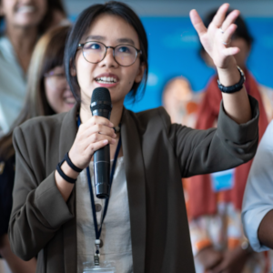

---
hide:
  - toc
  - navigation
---
<!--
CHECKLIST FOR THIS PAGE:
- [ ] Replace [YOUR NAME] with your full name (3 places)
- [ ] Replace [YOUR JOB TITLE] with your current or target role
- [ ] Replace [YOUR TAGLINE] with a short phrase describing your focus
- [ ] Rewrite the About Me paragraph with your own words
- [ ] Replace assets/images/profile.png with your actual photo (keep the filename or update it below)
- [ ] Replace assets/images/about.png with your own image (a field photo, map, or workspace shot)
- [ ] Edit the skill cards to match your actual skills (add, remove, or rename cards as needed)
- [ ] Update GitHub and LinkedIn links in the Connect section
- [ ] Add your CV PDF to docs/assets/ and update the filename in the Download CV button
-->

  
  <h1>Khaing Su Lwin</h1>
  
<strong>Independent Research Consultant</strong>

  
<em>Water security | Climate Resilience | Nature-based Solutions | Southeast Asia</em>

---

## About Me

I'm a researcher and engineer by training working at the intersection of water security, climate resilience, nature-based solutions, and environmental governance in Southeast Asia and the Mekong region.
Most recently at Stockholm Environment Institute (SEI Asia) in Bangkok — first as a Fellow for Research to Policy and subsequently as a Research Consultant: my work focused on synthesising evidence and generating recommendations through systematic evidence mapping, qualitative research, and stakeholder engagement with researchers, governments, regional bodies, and development partners.

My recent work includes a first-authored, peer-reviewed publication in the Nature-Based Solutions journal. I bring qualitative research methods (NVivo, systematic mapping, key informant interviews), native Burmese language fluency, and a growing foundation in GIS and spatial analysis. I'm currently seeking researcher, analyst, and programme officer roles with regional organisations, INGOs, and think tanks working on water, climate resilience, or environmental governance in Asia.

I also use this space to think publicly and document my observations on topics that interest me beyond my research — ecology, urban life, and inclusivity - among others.

  

---

[View My Projects :material-arrow-right:](projects/index.md){ .md-button .md-button--primary }
[Download CV :material-download:](assets/khaing-su-lwin-CV.pdf){ .md-button }

---

## Skills

-   :material-magnify:{ .lg .middle } **Research & Analysis**

    ---

    - Systematic evidence mapping and literature review
    - Qualitative coding and analysis — NVivo
    - Key informant interviews and focus group design
    - Data collection, synthesis, and reporting

-   :material-file-document:{ .lg .middle } **Research Communication**

    ---

    - Peer-reviewed academic writing
    - Policy reports and synthesis reports
    - Blog writing and science communication
    - Podcast production and event facilitation

-   :material-account-group:{ .lg .middle } **Stakeholder Engagement**

    ---

    - Multi-stakeholder workshop design and facilitation
    - Community consultation
    - Regional network coordination
    - Youth engagement and capacity building

-   :material-map:{ .lg .middle } **GIS & Spatial Analysis**

    ---

    - QGIS (operational)
    - Python GIS programming (introductory — in progress)
    - Spatial analysis — MIT OpenCourseWare, Spatial Thoughts (ongoing)
    - Data visualisation — Datawrapper, Flourish

-   :material-code-braces:{ .lg .middle } **Technical Tools**

    ---

    - Excel
    - Python (familiar — in progress)
    - Academic training — SWAT, HEC-RAS, ENVI
    - Reference management software

-   :material-translate:{ .lg .middle } **Languages**

    ---

    - Burmese (native)
    - English (fluent)
    - French (A2–B1)

---

## Connect

[LinkedIn](https://linkedin.com/in/khaing-su-lwin){ .md-button }
